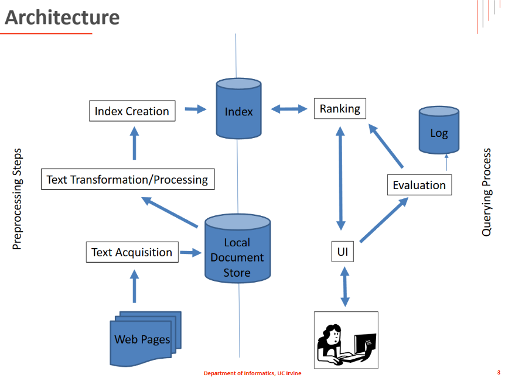

# CS121 - Web Crawler

**Date:** 05/03/2024  

## 🌐 Overview
This project is a web crawler developed for CS121-Information Retrieval. It is capable of crawling allowed web pages under certain domains, collecting word frequencies, tracking visited URLs, and avoiding traps such as infinite crawling or duplicate pages.

---

## 🔧 Global Variables
- **not_allowed**: URLs disallowed by `robots.txt`.
- **visited_page**: Total number of pages visited.
- **visited**: Set of visited URLs (to avoid duplication).
- **longest_number**: Word count of the longest page.
- **longest_url**: URL of the longest page.
- **WordCount**: Dictionary of word frequency.
- **domain**: Dictionary counting domain frequency.
- **depth**: Tracks page depth to detect traps.
- **finger_print**: Stores fingerprints for similarity detection.
- **stop_words**: Set of ignored words.

---

## 🧠 Main Functions

### `scraper(url, resp)`
1. Calls `extract_next_links` on a valid URL.
2. Handles and skips unknown exceptions gracefully.

---

### `printall()`
1. Displays and writes the longest page URL and word count.
2. Outputs:
   - `result.txt`: Summary including total pages, longest URL, sorted word and domain frequencies.
   - `not_allowed.txt`: URLs disallowed by `robots.txt`.
   - `visited.txt`: All visited URLs.

---

### `extract_next_links(url, resp)`
1. Checks for a 200 OK status; returns `[]` otherwise.
2. Detects traps based on depth (>20), logs to `ING_trap.txt`.
3. Handles encoding using `Content-Type`, defaults to `utf-8`.
4. Parses HTML using `BeautifulSoup`.
5. Discards empty pages or overly large files (>1,000,000 chars); logs to:
   - `ING_empty_file.txt`
   - `ING_too_large_file.txt`
6. Computes fingerprints using hashed 3-word sequences. If similarity > 95%, skips and logs to `ING_similar.txt`.
7. Extracts and normalizes links using `urllib` and `posixpath`.
8. Updates:
   - `WordCount`
   - `longest_url`
   - `domain` frequency
   - `visited_page` count
9. Valid links are added to the return list and marked as visited.

---

### `is_valid(url)`
1. Rejects banned URLs from `not_allowed`.
2. Only allows `http`/`https` schemes.
3. Only allows domains ending in:
   - `ics.uci.edu`
   - `stat.uci.edu`
   - `informatics.uci.edu`
   - `cs.uci.edu`
4. Rejects URLs containing `calendar` or `stayconnected`.
5. Rejects URLs longer than 300 characters.
6. Uses `robots.txt` via `urllib.robotparser` to check permissions.
7. Applies regex filtering for invalid URL patterns.
8. Handles SSL exceptions politely by returning `False`.

---

## 📄 Output Files
- `result.txt`: Final statistics and sorted data.
- `not_allowed.txt`: Disallowed URLs by robots.txt.
- `visited.txt`: Successfully visited pages.
- `ING_trap.txt`: Trap URLs (too deep).
- `ING_empty_file.txt`: Empty pages.
- `ING_too_large_file.txt`: Pages too large to parse.
- `ING_similar.txt`: Duplicate/similar pages.

---

## 📚 Dependencies
- `BeautifulSoup` (`bs4`)
- `urllib`
- `urlparse`
- `posixpath`
- `robotparser`

---

## ✅ Notes
- Make sure to run the crawler within allowed domains and under reasonable depth limits.
- Adjust thresholds (e.g. trap depth, similarity, page size) based on future requirements.

